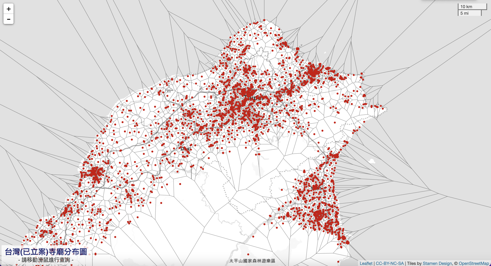

# Voronoi Diagram of 台灣(已立案)寺廟

- Demo 網站：https://aws.cclljj.net/TW_Temple/
- 土地公寺廟限定版：https://aws.cclljj.net/TW_Temple/index-tudigong.html

- 資料來源：
  - 全國宗教資訊系統資料-寺廟 [https://data.gov.tw/dataset/8203]
  - 臺灣北區主祀土地公寺廟點位資訊(臺北市、新北市、基隆市、桃園市、新竹市、新竹縣) [https://data.gov.tw/dataset/113346]
