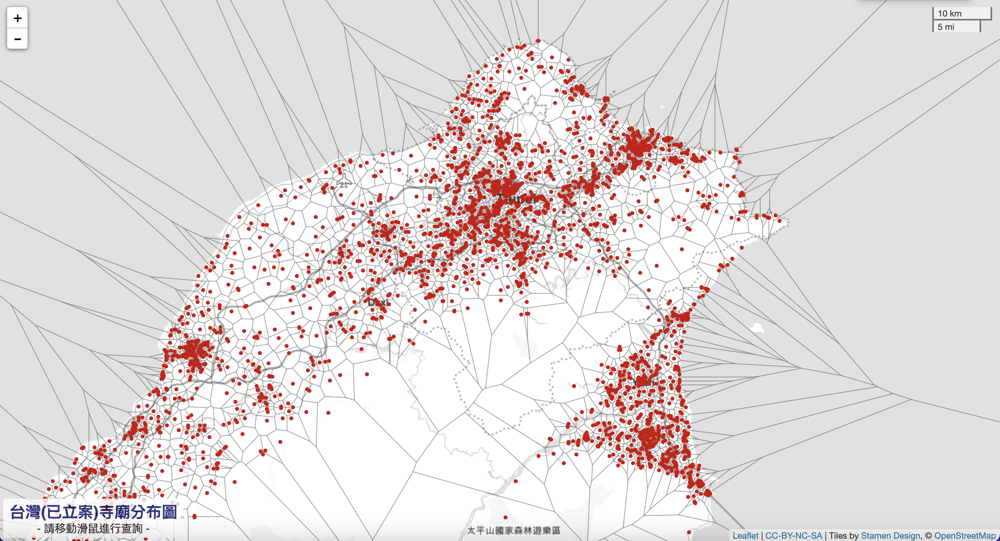

# 台灣寺廟分佈 Voronoi 地圖

以 Voronoi 圖視覺化台灣全國已立案寺廟的地理分佈，讓使用者直觀探索各地宗教場所的空間格局。

**Demo：** [https://cclljj.github.io/TW_Temple/](https://cclljj.github.io/TW_Temple/)  
**土地公版：** [https://cclljj.github.io/TW_Temple/index-tudigong.html](https://cclljj.github.io/TW_Temple/index-tudigong.html)



---

## 專案簡介

本專案以 D3.js 和 Leaflet 將政府開放資料（全國宗教資訊系統）繪製成互動式 Voronoi 地圖。每個多邊形代表距離對應寺廟最近的區域，使用者可移動滑鼠或點擊查看寺廟詳細資訊。

另提供**土地公寺廟限定版**，專注顯示台灣北部六縣市（台北市、新北市、基隆市、桃園市、新竹市、新竹縣）的土地公廟分佈。

---

## 功能特色

- **Voronoi 地圖**：動態計算每個視角下的 Voronoi 多邊形，隨地圖縮放與平移即時更新
- **懸停查詢**：滑鼠移至區域即顯示寺廟名稱、地址、主神、宗教、負責人及電話
- **點擊選取**：點擊固定顯示寺廟資訊
- **主神篩選**：可透過 checkbox 篩選不同主神類型的寺廟
- **響應式設計**：支援桌機、平板與手機

---

## 資料集

| 資料集 | 筆數 | 說明 |
|--------|------|------|
| [全國宗教資訊系統－寺廟](https://data.gov.tw/dataset/8203) | 11,472 筆 | 全台已立案寺廟，含經緯度、地址、主神、宗教、負責人、電話 |
| [臺灣北區主祀土地公寺廟點位資訊](https://data.gov.tw/dataset/113346) | 331 筆 | 台北市、新北市、基隆市、桃園市、新竹市、新竹縣土地公廟 |

---

## 技術架構

| 類別 | 套件 |
|------|------|
| 地圖 | [Leaflet 0.7.7](https://leafletjs.com) |
| 資料視覺化 | [D3.js v3](https://d3js.org) |
| 圖磚 | [CartoDB Positron](https://carto.com/basemaps/) |
| 資料格式 | TSV（政府開放資料） |
| 部署 | GitHub Pages（GitHub Actions 自動部署） |

---

## 專案結構

```
TW_Temple/
├── index.html                      # 全台寺廟版
├── index-tudigong.html             # 土地公寺廟版（北部六縣市）
├── js/
│   ├── voronoi-main.js             # 全台版 Voronoi 地圖邏輯
│   └── voronoi-main-tudigong.js    # 土地公版 Voronoi 地圖邏輯
├── css/
│   └── voronoi-map.css             # 地圖樣式
├── data/
│   ├── temple.tsv                  # 全台寺廟資料
│   └── data.tsv                    # 土地公寺廟資料
├── leaflet/                        # Leaflet 函式庫
├── Temples.png                     # 全台版預覽圖
└── Tudigong.png                    # 土地公版預覽圖
```

---

## 本地開發

需要 Python 3，執行後開啟 [http://localhost:8080](http://localhost:8080)：

```bash
python3 -m http.server 8080
```

---

## 相關資源

- Voronoi 地圖實作參考：[Building a Voronoi Map with D3 and Leaflet](https://chriszetter.com/blog/2014/06/15/building-a-voronoi-map-with-d3-and-leaflet/) by Chris Zetter
- 全國宗教資訊系統：[https://religion.moi.gov.tw](https://religion.moi.gov.tw)

---

## 授權

[MIT License](LICENSE) © 2022 Ling-Jyh Chen
